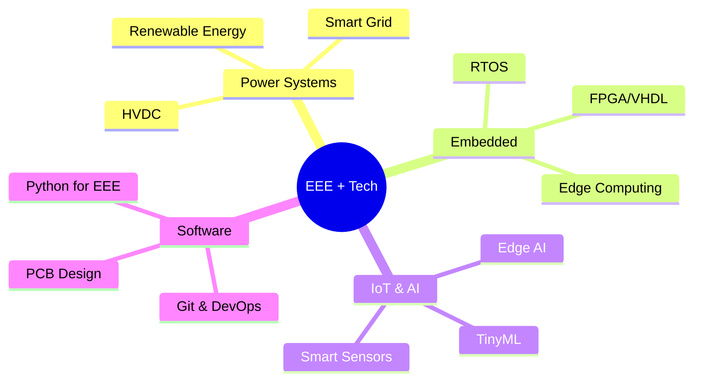

<div align="center">
<!-- Animated Header Banner -->

<!-- Typing Animation -->
<a href="https://git.io/typing-svg">
  
</a>
<br/>
<!-- Profile Views & Social Badges -->

&nbsp;
<a href="https://linkedin.com/in/YOUR_LINKEDIN">
  
</a>
&nbsp;
<a href="mailto:YOUR_EMAIL">
  
</a>
&nbsp;
<a href="https://YOUR_PORTFOLIO.com">
  
</a>
</div>
---
 
## ⚡ About Me
 
```yaml
name:        "Mahfuz Anam Arnob"
college:     "Mymensingh Engineering College (MEC)"
department:  "Electrical & Electronics Engineering (EEE)"
batch:       "16"
location:    "Mymensingh, Bangladesh 🇧🇩"
 
focus:
  - "⚙️  Embedded Systems & Microcontrollers (Arduino, STM32, ESP32)"
  - "🔌  Power Electronics & Renewable Energy"
  - "📡  IoT & Wireless Communication"
  - "🧠  Signal Processing & Control Systems"
 
currently_learning:
  - "FPGA Programming with VHDL/Verilog"
  - "Machine Learning for EEE Applications"
  - "PCB Design with KiCad & Altium"
 
fun_fact:    "I debug circuits with a multimeter AND git blame 😄"
```
 
---
 
## 🛠️ Tech & Tools Arsenal
 
<div align="center">
### 💻 Programming & Scripting


 
### ⚡ Hardware & Embedded


 
### 🔧 EDA & Simulation Tools


 
### 🌐 Web & Other Tools


 
</div>
---
 
## 📊 GitHub Stats
 
<div align="center">


</div>
---
 
## 🚀 Featured Projects
 
<div align="center">
<a href="https://github.com/YOUR_USERNAME/PROJECT_1">
  
</a>
<a href="https://github.com/YOUR_USERNAME/PROJECT_2">
  
</a>
</div>
### 🔬 Notable Projects
 
| 🏷️ Project | 📋 Description | 🛠️ Tech Stack | ⭐ |
|---|---|---|---|
| **Smart Energy Monitor** | Real-time power consumption tracker with IoT dashboard | ESP32, MQTT, Python | ⚡ |
| **Automatic Load Controller** | PLC-based industrial load balancing system | PLC, Ladder Logic, SCADA | 🏭 |
| **Line Follower Robot** | Autonomous robot with PID control | Arduino, C++, IR Sensors | 🤖 |
| **Solar MPPT Controller** | Maximum Power Point Tracking for solar panels | STM32, MATLAB Simulink | ☀️ |
 
---
 
## 🏆 Achievements & Certifications
 
<div align="center">

</div>
- 🥇 **[Competition/Hackathon Name]** — [Year], [Position]
- 📜 **[Certification Name]** — Issued by [Organization]
- 🏫 **Dean's List** — Mymensingh Engineering College, [Semester]
- 🔬 **Project Showcase** — [Event Name, Year]
---
 
## 📈 Coding Activity
 
<div align="center">
<!--START_SECTION:waka-->
<!-- This auto-updates if you set up WakaTime integration -->
<!--END_SECTION:waka-->
 
```text
⚡ Weekly Dev Breakdown
C/C++          ████████████░░░░░   48%
Python         ██████░░░░░░░░░░░   24%
MATLAB         ████░░░░░░░░░░░░░   16%
Shell/Bash     ██░░░░░░░░░░░░░░░    8%
Other          █░░░░░░░░░░░░░░░░    4%
```
 
</div>
---
 
## 🌱 Currently Exploring
 
<div align="center">

 
</div>
---
 
## 🤝 Let's Connect & Collaborate
 
<div align="center">
> *"The measure of intelligence is the ability to change."* — Albert Einstein
 
I'm always open to:
- 🔭 **Research collaborations** in power systems or embedded systems
- 💡 **Project discussions** on IoT, automation, or renewable energy
- 🌍 **Open source contributions** to EEE-related tools
- 📚 **Knowledge sharing** with fellow engineers
<br/>
**📬 Reach me at:** `your.email@example.com`
 
<br/>

</div>
