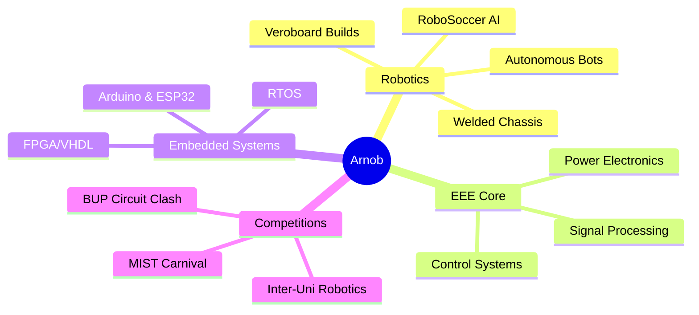

<div align="center">
<!-- Animated Header Banner -->

<!-- Typing Animation -->
<a href="https://git.io/typing-svg">
  
</a>
<br/><br/>
 

&nbsp;
<a href="https://linkedin.com/in/YOUR_LINKEDIN">
  
</a>
&nbsp;
<a href="mailto:hassanarnob773@gmail.com">
  
</a>
</div>
---
 
## 🤖 About Me
 
```yaml
name:        "Mahfuz Anam Arnob"
college:     "Mymensingh Engineering College (MEC)"
department:  "Electrical & Electronics Engineering (EEE)"
location:    "Mymensingh, Bangladesh 🇧🇩"
 
identity:
  - "🔩  I weld my own bot chassis with bare hands"
  - "🪛  Hand soldering on veroboard is my therapy"
  - "🏆  RoboSoccer Champion — MEC Inter-College"
  - "🤖  Creator of Cozmo Clench Bot"
  - "⚡  Circuit breaker at BUP Circuit Clash"
  - "🎪  Veteran of MIST Robotics Carnival"
 
currently_learning:
  - "PID Control for Autonomous Robots"
  - "FPGA Programming with VHDL/Verilog"
  - "PCB Design with KiCad"
 
fun_fact: "I've burned more solder than most people have ever seen 🔥"
```
 
---
 
## 🏆 Competitions & Battle Record
 
<div align="center">
<svg width="740" height="100" viewBox="0 0 740 100" xmlns="http://www.w3.org/2000/svg">
  <defs>
    <linearGradient id="goldGrad" x1="0%" y1="0%" x2="100%" y2="100%">
      <stop offset="0%" style="stop-color:#FFD700;stop-opacity:1" />
      <stop offset="100%" style="stop-color:#FFA500;stop-opacity:1" />
    </linearGradient>
    <linearGradient id="blueGrad" x1="0%" y1="0%" x2="100%" y2="100%">
      <stop offset="0%" style="stop-color:#0078d4;stop-opacity:1" />
      <stop offset="100%" style="stop-color:#00d4ff;stop-opacity:1" />
    </linearGradient>
    <linearGradient id="greenGrad" x1="0%" y1="0%" x2="100%" y2="100%">
      <stop offset="0%" style="stop-color:#00b09b;stop-opacity:1" />
      <stop offset="100%" style="stop-color:#96c93d;stop-opacity:1" />
    </linearGradient>
    <linearGradient id="purpleGrad" x1="0%" y1="0%" x2="100%" y2="100%">
      <stop offset="0%" style="stop-color:#7928ca;stop-opacity:1" />
      <stop offset="100%" style="stop-color:#a855f7;stop-opacity:1" />
    </linearGradient>
  </defs>
  <!-- Card 1: RoboSoccer Champion -->
  <rect x="5" y="5" width="168" height="88" rx="14" fill="#FFD700" fill-opacity="0.08" stroke="#FFD700" stroke-width="1.5"/>
  <text x="89" y="34" text-anchor="middle" font-size="24">🏆</text>
  <text x="89" y="56" text-anchor="middle" fill="#FFD700" font-size="11" font-weight="bold">ROBOSOCCER</text>
  <text x="89" y="70" text-anchor="middle" fill="#FFD700" font-size="11" font-weight="bold">CHAMPION</text>
  <text x="89" y="85" text-anchor="middle" fill="#a0c4ff" font-size="9">MEC Inter-College 🥇</text>
  <!-- Card 2: MIST Robotics Carnival -->
  <rect x="183" y="5" width="168" height="88" rx="14" fill="#00d4ff" fill-opacity="0.08" stroke="#00d4ff" stroke-width="1.5"/>
  <text x="267" y="34" text-anchor="middle" font-size="24">🎪</text>
  <text x="267" y="56" text-anchor="middle" fill="#00d4ff" font-size="11" font-weight="bold">MIST ROBOTICS</text>
  <text x="267" y="70" text-anchor="middle" fill="#00d4ff" font-size="11" font-weight="bold">CARNIVAL</text>
  <text x="267" y="85" text-anchor="middle" fill="#a0c4ff" font-size="9">MIST University, Dhaka</text>
  <!-- Card 3: BUP Circuit Clash -->
  <rect x="361" y="5" width="168" height="88" rx="14" fill="#96c93d" fill-opacity="0.08" stroke="#96c93d" stroke-width="1.5"/>
  <text x="445" y="34" text-anchor="middle" font-size="24">⚡</text>
  <text x="445" y="56" text-anchor="middle" fill="#96c93d" font-size="11" font-weight="bold">BUP CIRCUIT</text>
  <text x="445" y="70" text-anchor="middle" fill="#96c93d" font-size="11" font-weight="bold">CLASH</text>
  <text x="445" y="85" text-anchor="middle" fill="#a0c4ff" font-size="9">Bangladesh Univ. of Professionals</text>
  <!-- Card 4: Inter-University -->
  <rect x="539" y="5" width="196" height="88" rx="14" fill="#a855f7" fill-opacity="0.08" stroke="#a855f7" stroke-width="1.5"/>
  <text x="637" y="34" text-anchor="middle" font-size="24">🤖</text>
  <text x="637" y="56" text-anchor="middle" fill="#a855f7" font-size="11" font-weight="bold">INTER-UNIVERSITY</text>
  <text x="637" y="70" text-anchor="middle" fill="#a855f7" font-size="11" font-weight="bold">ROBOTICS</text>
  <text x="637" y="85" text-anchor="middle" fill="#a0c4ff" font-size="9">Multi-University Contestant</text>
</svg>
</div>
<br/>
| 🎯 Event | 🏛️ Host | 🤖 Category | 🏅 Result |
|---|---|---|---|
| 🥇 **RoboSoccer Championship** | Mymensingh Engineering College | Autonomous Soccer Bot | **🏆 CHAMPION** |
| ⚡ **BUP Circuit Clash** | Bangladesh University of Professionals | Circuit Design | Participant |
| 🎪 **MIST Robotics Carnival** | Military Institute of Sci & Tech | Robotics Contest | Participant |
| 🤖 **Inter-University Robotics** | Multiple Universities 🇧🇩 | Various Categories | Multi-time Participant |
 
---
 
## 🤖 Signature Build — Cozmo Clench Bot
 
<div align="center">
<svg width="720" height="170" viewBox="0 0 720 170" xmlns="http://www.w3.org/2000/svg">
  <defs>
    <linearGradient id="botGrad" x1="0%" y1="0%" x2="100%" y2="0%">
      <stop offset="0%" style="stop-color:#0f2027"/>
      <stop offset="50%" style="stop-color:#203a43"/>
      <stop offset="100%" style="stop-color:#2c5364"/>
    </linearGradient>
  </defs>
  <rect width="720" height="170" rx="16" fill="url(#botGrad)" stroke="#00d4ff" stroke-width="1.5"/>
  <text x="65" y="100" text-anchor="middle" font-size="72">🤖</text>
  <line x1="125" y1="20" x2="125" y2="150" stroke="#00d4ff" stroke-width="0.8" opacity="0.4"/>
  <text x="150" y="42" fill="#00d4ff" font-size="20" font-weight="bold">Cozmo Clench Bot</text>
  <text x="150" y="62" fill="#a0c4ff" font-size="12">Custom-welded steel chassis · Hand-soldered veroboard circuits · Competition grade</text>
  <rect x="150" y="76" width="120" height="22" rx="11" fill="#ff6b35" fill-opacity="0.2" stroke="#ff6b35" stroke-width="1"/>
  <text x="210" y="91" text-anchor="middle" fill="#ff6b35" font-size="10" font-weight="bold">🔩 Welded by Hand</text>
  <rect x="280" y="76" width="140" height="22" rx="11" fill="#FFD700" fill-opacity="0.2" stroke="#FFD700" stroke-width="1"/>
  <text x="350" y="91" text-anchor="middle" fill="#FFD700" font-size="10" font-weight="bold">🪛 Veroboard Circuits</text>
  <rect x="430" y="76" width="130" height="22" rx="11" fill="#96c93d" fill-opacity="0.2" stroke="#96c93d" stroke-width="1"/>
  <text x="495" y="91" text-anchor="middle" fill="#96c93d" font-size="10" font-weight="bold">⚙️ Custom Mechanics</text>
  <rect x="570" y="76" width="120" height="22" rx="11" fill="#00d4ff" fill-opacity="0.2" stroke="#00d4ff" stroke-width="1"/>
  <text x="630" y="91" text-anchor="middle" fill="#00d4ff" font-size="10" font-weight="bold">🏆 Competition Bot</text>
  <text x="150" y="128" fill="#c9d1d9" font-size="11">Built from zero — forged the steel frame with a welder, laid every track on veroboard</text>
  <text x="150" y="146" fill="#c9d1d9" font-size="11">with a soldering iron. Cozmo Clench is 100% hand-made, 100% Arnob-made.</text>
</svg>
</div>
---
 
## 🔧 The Maker's Arsenal
 
<div align="center">
<svg width="700" height="72" viewBox="0 0 700 72" xmlns="http://www.w3.org/2000/svg">
  <defs>
    <linearGradient id="cardBg" x1="0%" y1="0%" x2="0%" y2="100%">
      <stop offset="0%" style="stop-color:#161b22"/>
      <stop offset="100%" style="stop-color:#0d1117"/>
    </linearGradient>
  </defs>
  <rect x="4" y="4" width="124" height="64" rx="12" fill="url(#cardBg)" stroke="#ff6b35" stroke-width="1.5"/>
  <text x="66" y="34" text-anchor="middle" font-size="24">🪛</text>
  <text x="66" y="56" text-anchor="middle" fill="#ff6b35" font-size="10" font-weight="bold">HAND SOLDERING</text>
  <rect x="138" y="4" width="124" height="64" rx="12" fill="url(#cardBg)" stroke="#00d4ff" stroke-width="1.5"/>
  <text x="200" y="34" text-anchor="middle" font-size="24">🟩</text>
  <text x="200" y="56" text-anchor="middle" fill="#00d4ff" font-size="10" font-weight="bold">VEROBOARD</text>
  <rect x="272" y="4" width="124" height="64" rx="12" fill="url(#cardBg)" stroke="#FFD700" stroke-width="1.5"/>
  <text x="334" y="34" text-anchor="middle" font-size="24">🔥</text>
  <text x="334" y="56" text-anchor="middle" fill="#FFD700" font-size="10" font-weight="bold">METAL WELDING</text>
  <rect x="406" y="4" width="124" height="64" rx="12" fill="url(#cardBg)" stroke="#96c93d" stroke-width="1.5"/>
  <text x="468" y="34" text-anchor="middle" font-size="24">⚙️</text>
  <text x="468" y="56" text-anchor="middle" fill="#96c93d" font-size="10" font-weight="bold">BOT CHASSIS</text>
  <rect x="540" y="4" width="156" height="64" rx="12" fill="url(#cardBg)" stroke="#a855f7" stroke-width="1.5"/>
  <text x="618" y="34" text-anchor="middle" font-size="24">📐</text>
  <text x="618" y="56" text-anchor="middle" fill="#a855f7" font-size="10" font-weight="bold">CIRCUIT DESIGN</text>
</svg>
<br/><br/>
 
### 💻 Programming & Embedded


 


 
### 🔬 EDA & Simulation


 
</div>
---
 
## 📊 GitHub Stats
 
<div align="center">


</div>
---
 
## 🏅 GitHub Trophies
 
<div align="center">

</div>
---
 
## 🌱 Roadmap
 
<div align="center">

 
</div>
---
 
## 🤝 Let's Build Something
 
<div align="center">
> *"Any sufficiently advanced technology is indistinguishable from magic."* — Arthur C. Clarke
>
> *I prefer to show the magic by hand-soldering it myself.* — **Arnob** ⚡
 
<br/>
I'm always open to **robotics team-ups**, **hardware collabs**, and **competition squads** across Bangladesh 🇧🇩
 
**📬 Reach me:** `hassanarnob773@gmail.com`
 
<br/>

</div>
 
